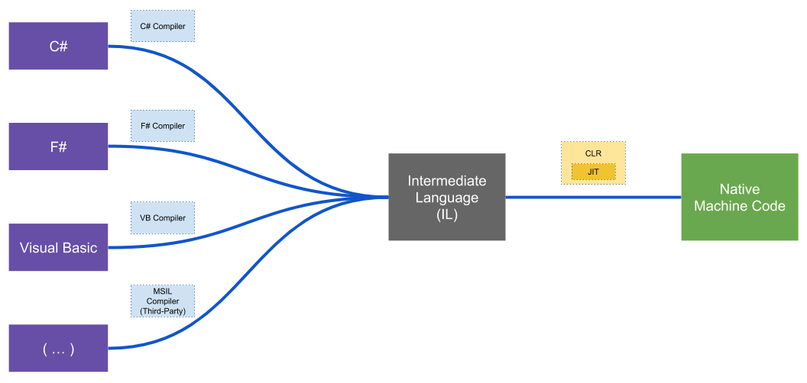

# Como funcionam as aplicações .NET?

Aplicações .NET, quando compiladas, são hardware-agnostic. Em especial, aplicações .NET Core são cross-platform e cross-architecture, isto é, a mesma aplicação é executada de forma consistente no Windows, Linux e macOS, e em diferentes tipos de computadores ou processadores, incluindo x64, x86 e ARM.

O desenvolvimento também não está restrito a apenas uma linguagem:

Cada linguagem tem seu compilador específico. O código-fonte é compilado para uma linguagem intermediária, contido nos assemblies. Ao ser executado, o JIT (Just-in-Time compiler), que é responsável por fazer a compilação para código nativo de máquina.

O JIT é um componente do CLR (Common Language Runtime), o runtime do .NET. Além da compilação just-in-time, o CLR provê outros benefícios como:
* Alocação e gerenciamento de memória;
* Garbage collection;
* Interoperabilidade entre linguagens;
* Segurança enforçada.