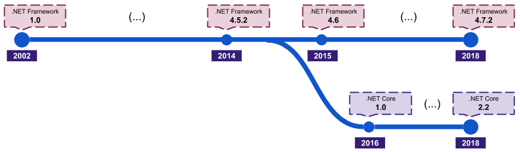
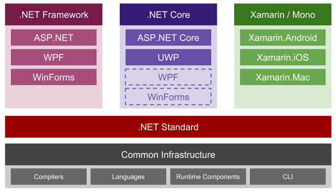

# O que é .NET?
o .NET é uma plataforma de desenvolvimento para diversos tipos de aplicações, incluindo:
* Web
* Mobile
* Desktop
* Gaming
* IoT

A primeira versão do .NET foi lançada pela Microsoft em 2002. Desde então, mudanças significativas aconteceram:

Em 2014, a Microsoft anunciou o desenvolvimento da próxima geração do ASP.NET, então chamado de ASP.NET vNext. Esta nova versão trouxe novas e importantes características:
* Cloud-optimized: idealizado para aplicações cloud-native, otimizado para cenários de baixa memória e alto throughput.
* Open-souce: código aberto para todo o framework, incluindo o runtime, compiladores e bibliotecas.
* Cross-platform: executável nos sistemas operacionais Windows, Linux e macOS.

O ASP.NET vNext foi inicialmente denominado ASP.NET 5. Porém, as mudanças foram tão significativas que elas deram origem a uma nova implementação do .NET, o .NET Core.

Atualmente, .NET é um umbrella-term para as diversas implementações .NET, seus frameworks de aplicação, bibliotecas e infraestrutura compartilhada:

